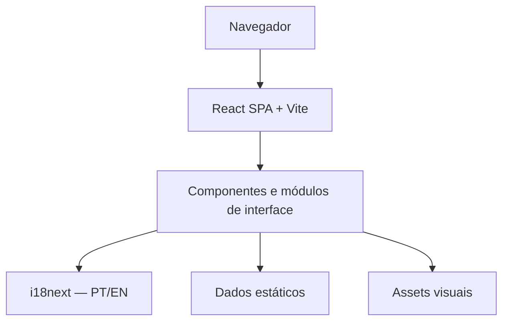

# Josiane Gonçalves — Software Developer Portfolio

Portfólio profissional desenvolvido como uma experiência interativa inspirada em interfaces HUD e sistemas de jogos, apresentando projetos, trajetória, competências técnicas e processo de desenvolvimento de software.

🌐 **[Acessar portfólio publicado](https://josiane-goncalves-portfolio.vercel.app/)**

<p align="center">
  
</p>

## Sobre o projeto

Desenvolvi este portfólio para apresentar mais do que uma lista de tecnologias. A proposta é mostrar como organizo o desenvolvimento de software desde a compreensão do problema e dos requisitos até a implementação, os testes, a documentação, a validação e a entrega incremental.

A experiência também conecta minha trajetória em saúde e Engenharia Clínica ao desenvolvimento de software. Esse contexto orienta parte da linguagem visual e ajuda a explicar projetos como o PulseOps, voltado a operações com equipamentos médico-hospitalares.

## Conceito visual

A interface adota uma linguagem autoral inspirada conceitualmente em HUDs, menus de jogos, software de operações e sistemas técnicos. A direção combina uma atmosfera tática e cinematográfica com hierarquia de informação, estados semânticos, animações ambientais e microinterações.

Referências do universo de jogos contribuíram para a direção criativa, mas a composição, a identidade profissional e a arquitetura visual deste portfólio foram desenvolvidas para o projeto atual.

### Elementos da experiência

- **Character Stage:** área central dedicada à representação de Josiane e à composição principal.
- **Mission Files:** arquivo interativo para navegar pelos projetos em destaque e consultar seus registros.
- **Engineering Matrix:** tecnologias e áreas de atuação organizadas sem percentuais arbitrários.
- **Engineering Log:** trajetória profissional relacionada a ambientes, processos e decisões críticas.
- **Engineering Process:** fluxo de descoberta, requisitos, implementação, testes, validação, documentação e entrega.
- **Formação & Certificações:** formação acadêmica, certificação e treinamentos complementares.
- **Soft Skills:** competências comportamentais apresentadas como sinais visuais, sem métricas inventadas.
- **Contact HUD:** canais profissionais e acesso ao currículo.
- **Português e English:** conteúdo internacionalizado com persistência da preferência de idioma.
- **A.L.I.A.:** subsistema visual de apoio à engenharia.

### A.L.I.A.

**A.L.I.A. — Assistente Lógica de Implementação e Apoio** representa o uso supervisionado de inteligência artificial como ferramenta de suporte à pesquisa técnica, documentação, testes e investigação de erros. Ela não é um chatbot, agente autônomo ou sistema de IA executado dentro do portfólio.

## Projetos em destaque

### PulseOps

Sistema direcionado à consulta e ao controle operacional de equipamentos médico-hospitalares.

**Repositório:** [Josiane-Goncalves/pulseops](https://github.com/Josiane-Goncalves/pulseops)

### Prado em Dia

Portal de transparência e acompanhamento administrativo para condomínio de pequeno porte, criado para centralizar informações e apoiar o acompanhamento da gestão.

**Repositório:** [Josiane-Goncalves/prado-em-dia](https://github.com/Josiane-Goncalves/prado-em-dia)

### Ride Wars League

Aplicação gamificada voltada ao ciclismo, com ranking, badges e desafios, explorando a evolução da experiência entre versões.

**Repositório:** [Josiane-Goncalves/ride-wars-league](https://github.com/Josiane-Goncalves/ride-wars-league)

## Tecnologias utilizadas

### Stack do portfólio

| Área | Tecnologias |
| --- | --- |
| Interface | React, React DOM e TypeScript |
| Build e desenvolvimento | Vite e Node.js como ambiente de ferramentas |
| Estilos | CSS e Tailwind CSS |
| Internacionalização | i18next e react-i18next |
| Testes | Vitest, jsdom, React Testing Library, user-event e jest-dom |

Este repositório contém uma SPA executada no navegador. Ele não implementa API própria, backend ou banco de dados.

### Tecnologias apresentadas no perfil

`React • TypeScript • Node.js • APIs • PostgreSQL`

Essa lista comunica a stack profissional apresentada por Josiane e não deve ser interpretada como a arquitetura interna desta SPA.

## Engenharia e qualidade

O desenvolvimento foi organizado em fases pequenas, reversíveis e validadas. A suíte automatizada protege contratos e comportamentos relevantes, incluindo estrutura semântica, internacionalização, persistência de idioma, navegação dos Mission Files, estados dos módulos e integridade dos dados.

As validações de release incluem:

- testes unitários e de componentes com Vitest e React Testing Library;
- compilação TypeScript integrada ao build de produção;
- geração do bundle otimizado pelo Vite;
- verificação de whitespace com `git diff --check`;
- metadados de SEO com description, canonical e Open Graph;
- `robots.txt` e favicon;
- otimização dos assets visuais utilizados pela interface.

Não há afirmação de cobertura total ou ausência de bugs: os testes se concentram nos contratos relevantes para evolução segura do produto.

## Acessibilidade

O projeto inclui cuidados de acessibilidade confirmados no código:

- landmarks e hierarquia semântica de headings;
- link para pular diretamente ao conteúdo principal;
- navegação por teclado e estados de foco com `focus-visible`;
- rótulos ARIA, regiões identificadas e avisos dinâmicos;
- textos alternativos para conteúdo visual relevante;
- estados que não dependem exclusivamente da cor;
- contraste definido por tokens semânticos;
- tratamento de `prefers-reduced-motion`, reduzindo movimento decorativo sem ocultar conteúdo ou remover funcionalidade.

Esses recursos representam cuidados implementados no projeto, não uma declaração de conformidade formal com um nível específico da WCAG.

## Internacionalização

A interface está disponível em **Português** e **English** por meio de i18next. O idioma selecionado é persistido localmente e o atributo `lang` do documento acompanha a opção ativa (`pt-BR` ou `en`).

## Arquitetura

O portfólio utiliza uma arquitetura de SPA estática. Conteúdo profissional e projetos são mantidos em módulos de dados locais; componentes React consomem esses dados, traduções e assets visuais no navegador.



Não existem API, backend, banco de dados ou microsserviços na arquitetura deste portfólio.

## Estrutura do projeto

```text
portfolioJosiane/
├── public/
│   ├── cv/
│   ├── images/
│   ├── favicon.svg
│   └── robots.txt
├── src/
│   ├── app/
│   ├── assets/
│   ├── components/
│   ├── data/
│   ├── features/
│   ├── i18n/
│   ├── styles/
│   └── test/
├── index.html
├── package.json
├── tsconfig.json
└── vite.config.ts
```

## Executando localmente

Requisitos: Node.js e npm.

```bash
git clone https://github.com/Josiane-Goncalves/josiane-goncalves-portfolio.git
cd josiane-goncalves-portfolio
npm install
npm run dev
```

O Vite exibirá no terminal o endereço local da aplicação.

### Scripts

| Comando | Descrição |
| --- | --- |
| `npm run dev` | Inicia o servidor de desenvolvimento do Vite. |
| `npm run build` | Executa a compilação TypeScript e gera o build de produção. |
| `npm run preview` | Serve localmente o build gerado para inspeção. |
| `npm test` | Executa o Vitest em modo interativo. |
| `npm run test:run` | Executa a suíte de testes uma vez. |

## Deploy

A aplicação está publicada na Vercel:

**[josiane-goncalves-portfolio.vercel.app](https://josiane-goncalves-portfolio.vercel.app/)**

O deploy de produção foi realizado manualmente pelo Vercel CLI. Este README não pressupõe uma integração automática de CI/CD entre GitHub e Vercel.

## Autoria

**Josiane Gonçalves**<br />
Desenvolvedora de Software Júnior

- [GitHub](https://github.com/Josiane-Goncalves)
- [LinkedIn](https://www.linkedin.com/in/josianecgoncalves)
- [Portfólio](https://josiane-goncalves-portfolio.vercel.app/)

## Créditos

Este projeto partiu, com autorização, de uma [implementação existente](https://github.com/cairon-henrique-60/chgDEvPortfolio) utilizada como ponto de partida técnico. A base foi posteriormente redesenhada, reestruturada e adaptada para a identidade de Josiane, seu conteúdo profissional, a arquitetura visual atual e os objetivos deste portfólio.

O repositório não contém atualmente um arquivo `LICENSE`; por isso, este documento não atribui ou presume termos de licença que não estejam declarados no código-fonte.
