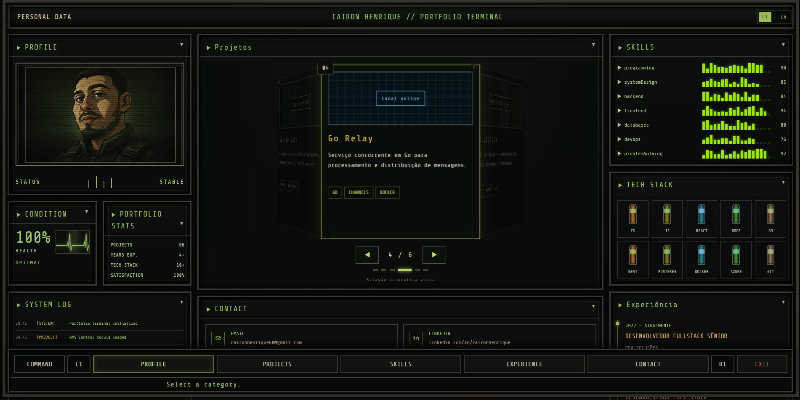

# Cairon Henrique — Portfolio Terminal

A retro-futuristic personal portfolio inspired by classic survival-horror game interfaces.

The project transforms a traditional developer portfolio into an interactive terminal experience, featuring CRT effects, animated system panels, a 3D project carousel, audio-meter-style skill bars, multilingual support, and a pixel-art profile presentation.

## Preview



## Live Demo

[Open the portfolio](https://your-portfolio-url.com)

## About the Project

This portfolio was created to present my professional experience, projects, technical skills, and contact information through a distinctive interface inspired by retro game inventory screens.

Instead of using a conventional portfolio layout, the application behaves like a fictional system terminal with:

- animated CRT scanlines;
- metallic and industrial panels;
- system status indicators;
- a rotating 3D project carousel;
- animated decibel-style skill meters;
- a heart-rate condition monitor;
- an animated pixel-art profile portrait;
- system activity logs;
- Portuguese and English language support.

The visual identity is inspired by late-1990s and early-2000s science-fiction and survival-horror interfaces while remaining fully responsive and accessible as a modern web application.

## Features

### Retro Terminal Interface

The application uses custom panels, terminal typography, scanlines, glow effects, noise overlays, grid backgrounds, and subtle animations to reproduce the atmosphere of an old military or scientific terminal.

### Interactive 3D Project Carousel

Projects are displayed inside a circular 3D carousel.

The carousel:

- rotates automatically;
- pauses when the user selects a project;
- supports previous and next navigation;
- includes project position indicators;
- highlights the currently selected project.

### Animated Skill Meters

Technical skills are displayed using segmented animated bars inspired by audio decibel meters.

Each skill meter:

- respects the configured skill percentage;
- generates randomized movement;
- uses green, amber, and red segments;
- includes glow and transition effects.

### Heart Rate Monitor

The condition panel includes an animated ECG graph with:

- a moving heartbeat waveform;
- a scanning light effect;
- background grid lines;
- terminal-style green glow.

### Animated Profile Portrait

The profile portrait uses:

- pixel-art styling;
- CRT scanlines;
- animated fog;
- background pulse effects;
- scanning beams;
- noise and vignette overlays.

### Internationalization

The interface supports:

- Portuguese;
- English.

The selected language is stored in `localStorage`, so the application remembers the user's preference.

### Responsive Design

The portfolio adapts to:

- desktop screens;
- laptops;
- tablets;
- mobile devices.

## Tech Stack

### Core

- React
- TypeScript
- Vite

### Styling

- Tailwind CSS
- Custom CSS animations
- CSS 3D transforms
- CSS gradients and masks

### Internationalization

- i18next
- react-i18next

### Development Tools

- ESLint
- npm
- Git

## Project Structure

```text
src/
├── components/
│   ├── BottomNav.tsx
│   ├── ContactPanel.tsx
│   ├── DecibelBar.tsx
│   ├── ExperiencePanel.tsx
│   ├── HeartRateGraph.tsx
│   ├── LanguageSelector.tsx
│   ├── Panel.tsx
│   ├── ProfilePanel.tsx
│   ├── ProfilePortrait.tsx
│   ├── ProjectsPanel.tsx
│   ├── SkillsPanel.tsx
│   ├── StatsPanel.tsx
│   └── SystemLogPanel.tsx
├── data/
│   └── portfolio.ts
├── i18n/
│   └── index.ts
├── styles/
│   └── global.css
├── App.tsx
├── main.tsx
└── vite-env.d.ts

public/
└── images/
    ├── profile-pixel.png
    └── portfolio-preview.png
```

## Getting Started

### Requirements

Before running the application, make sure you have installed:

- Node.js 20 or newer;
- npm 10 or newer.

Check your versions:

```bash
node --version
npm --version
```

### Installation

Clone the repository:

```bash
git clone https://github.com/cairon-henrique-60/your-repository-name.git
```

Enter the project directory:

```bash
cd your-repository-name
```

Install the dependencies:

```bash
npm install
```

Start the development server:

```bash
npm run dev
```

The application will usually be available at:

```text
http://localhost:5173
```

## Available Scripts

Start the development server:

```bash
npm run dev
```

Create a production build:

```bash
npm run build
```

Preview the production build locally:

```bash
npm run preview
```

Run ESLint:

```bash
npm run lint
```

## Customizing the Portfolio

### Personal Information

Update your profile information inside:

```text
src/i18n/index.ts
```

The profile content is available in both Portuguese and English:

```ts
profile: {
  role: "Software Developer",
  description: "Your professional description...",
  country: "Brazil",
  focus: "Full Stack",
}
```

### Projects

Project metadata is stored in:

```text
src/data/portfolio.ts
```

Example:

```ts
{
  id: 1,
  translationKey: "wmsControl",
  technologies: ["REACT", "TYPESCRIPT", "WEBSOCKET"],
  variant: "red",
}
```

Translated project content is stored in:

```text
src/i18n/index.ts
```

Example:

```ts
projects: {
  wmsControl: {
    title: "WMS Control",
    status: "Warehouse status",
    description:
      "Operational dashboard for checking, printing, tracking and logistics management.",
  },
}
```

When adding a new project:

1. Add the project metadata to `src/data/portfolio.ts`.
2. Add the Portuguese translation to `src/i18n/index.ts`.
3. Add the English translation to `src/i18n/index.ts`.
4. Add the new translation key to the `ProjectTranslationKey` type.

### Skills

Skills and their percentage values are stored in:

```text
src/data/portfolio.ts
```

Example:

```ts
export const skills = [
  ["programming", 90],
  ["systemDesign", 85],
  ["backend", 84],
  ["frontend", 94],
  ["databases", 80],
  ["devops", 76],
  ["problemSolving", 92],
] as const;
```

### Technologies

The technologies displayed in the inventory section are configured in:

```ts
export const stack = [
  "TS",
  "JS",
  "REACT",
  "NODE",
  "GO",
  "NEST",
  "POSTGRES",
  "DOCKER",
  "AZURE",
  "GIT",
] as const;
```

### Experience

Professional experience translations are located in:

```text
src/i18n/index.ts
```

Example:

```ts
experience: {
  items: {
    pda: {
      period: "2022 — PRESENT",
      role: "SENIOR FRONTEND DEVELOPER",
      company: "PDA SOLUÇÕES",
      description:
        "Development of React and TypeScript applications, integrations, printing solutions, WMS systems and enterprise platforms.",
    },
  },
}
```

### Profile Image

Place the pixel-art profile image at:

```text
public/images/profile-pixel.png
```

It is rendered by:

```text
src/components/ProfilePortrait.tsx
```

The portrait includes scanlines, glow, fog, vignette, noise, and scanning animations.

## Internationalization

Translations are configured in:

```text
src/i18n/index.ts
```

The current language is persisted using:

```ts
localStorage.setItem("portfolio-language", language);
```

To add another language:

1. Add a new language object to `resources`.
2. Translate all existing keys.
3. Add the language option to `LanguageSelector.tsx`.

Example:

```ts
const resources = {
  pt: {
    translation: {},
  },
  en: {
    translation: {},
  },
  es: {
    translation: {},
  },
};
```

## Building for Production

Generate the production files:

```bash
npm run build
```

The generated files will be available in:

```text
dist/
```

Test the production build locally:

```bash
npm run preview
```

## Deployment

The project can be deployed to platforms such as:

- Vercel;
- Netlify;
- GitHub Pages;
- Azure Static Web Apps;
- Cloudflare Pages.

### Vercel

Import the repository into Vercel and use:

```text
Build command: npm run build
Output directory: dist
```

### Netlify

Use the following configuration:

```text
Build command: npm run build
Publish directory: dist
```

## Performance Considerations

The project contains several visual effects and animations. To maintain good performance:

- animations use CSS whenever possible;
- intervals and timeouts are cleared during component cleanup;
- only the active carousel item receives full visual emphasis;
- decorative layers use `pointer-events: none`;
- animations can be disabled for users who prefer reduced motion.

Example:

```css
@media (prefers-reduced-motion: reduce) {
  *,
  *::before,
  *::after {
    animation-duration: 0.01ms !important;
    animation-iteration-count: 1 !important;
    scroll-behavior: auto !important;
  }
}
```

## Design Inspiration

The project is inspired by retro science-fiction and survival-horror game interfaces.

It is an independent portfolio design and is not affiliated with, endorsed by, or officially connected to Capcom or the Dino Crisis franchise.

All referenced trademarks and game titles belong to their respective owners.

## Roadmap

Future improvements may include:

- sound effects with a mute control;
- keyboard and gamepad navigation;
- project detail modals;
- GitHub API integration;
- downloadable résumé;
- theme intensity controls;
- loading and boot terminal sequence;
- achievement system;
- additional languages.

## Contributing

This is a personal portfolio project, but suggestions and improvements are welcome.

To contribute:

1. Fork the repository.
2. Create a new branch.

```bash
git checkout -b feature/your-feature
```

3. Commit your changes.

```bash
git commit -m "feat: add new feature"
```

4. Push the branch.

```bash
git push origin feature/your-feature
```

5. Open a pull request.

## License

This project is available under the MIT License.

See the `LICENSE` file for more information.

## Author

**Cairon Henrique**

Senior Frontend Developer focused on React, TypeScript, software architecture, enterprise platforms, logistics systems, integrations, and scalable digital experiences.

- GitHub: [cairon-henrique-60](https://github.com/cairon-henrique-60)
- LinkedIn: [Add your LinkedIn profile](https://www.linkedin.com/)
- Portfolio: [Add your portfolio URL](https://your-portfolio-url.com)

---

<p align="center">
  Built with React, TypeScript and Tailwind CSS.
</p>

<p align="center">
  <strong>SYSTEM STATUS: OPERATIONAL</strong>
</p>